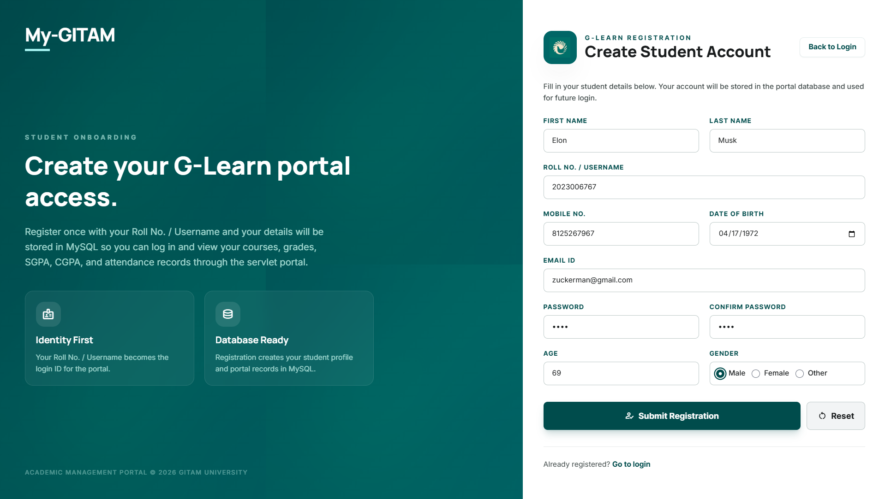
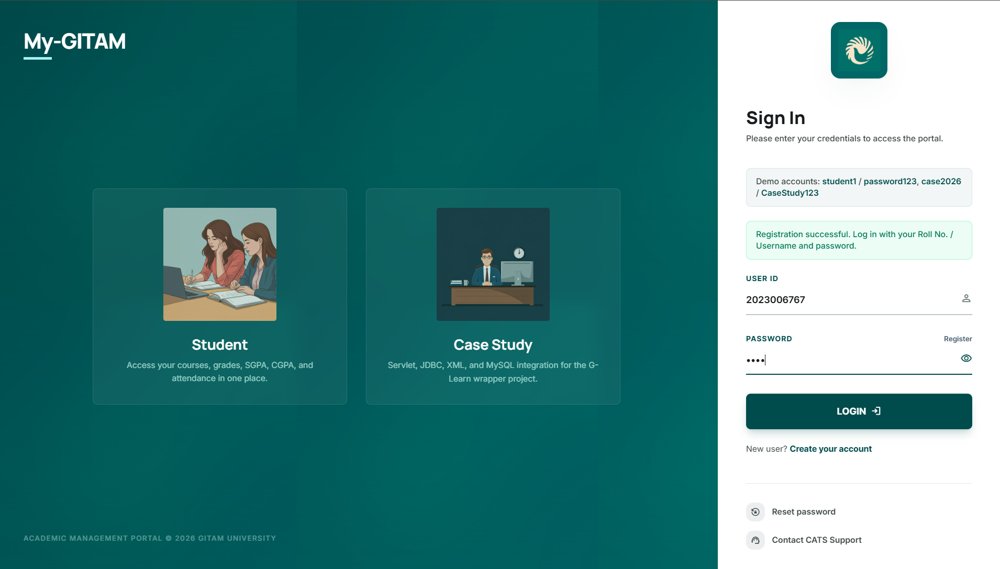
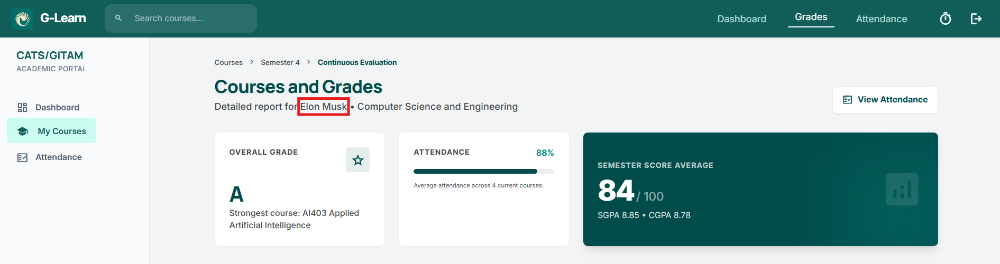
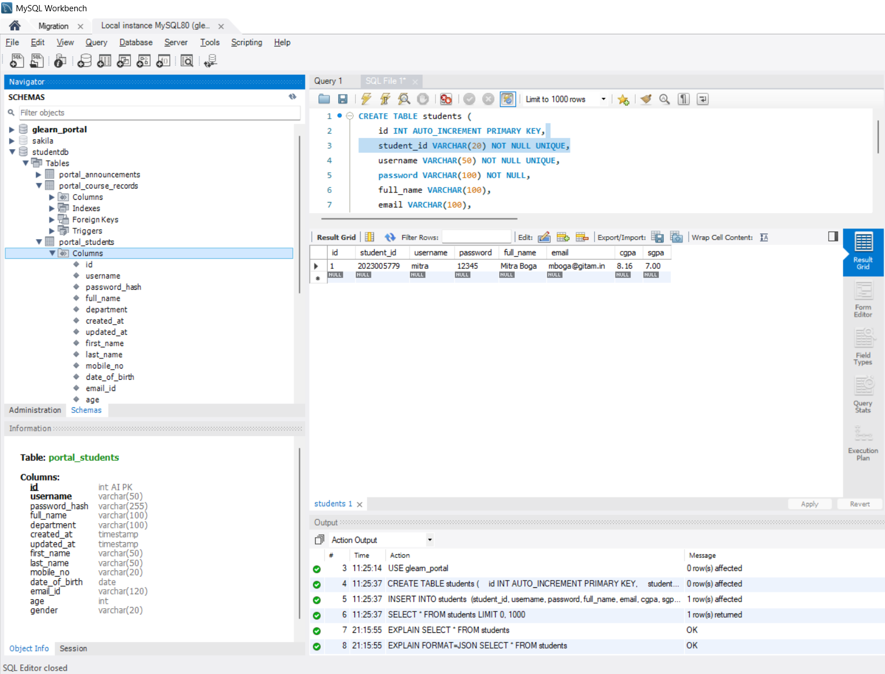

<h1 align="center">🎓 GLearnPortalWrapper 📔</h1>
<h3 align="center">Full-Stack Academic Portal System • Grades • Attendance • Authentication</h3>

<p align="center">
  
  
  
  
  
  
  
  
  
  
  
  
  
  
  
</p>

<p align="center">
  
</p>

---

## 📖 Project Overview

**GLearnPortalWrapper** is a **full-stack academic portal system** inspired by GITAM University's G-Learn platform, designed as an end-to-end web application integrating:

- HTML, CSS, JavaScript (Frontend)
- Java Servlets (Backend)
- MySQL + JDBC (Database)
- Apache Tomcat (Server)
- XML (Configuration + Data exchange)

The system enables students to **register, authenticate, and access personalized academic data**, including grades, SGPA/CGPA, and attendance — all backed by a persistent relational database.

📄 Full case study report: :contentReference[oaicite:0]{index=0}

---

## 🎯 Problem Statement

Build a **complete G-Learn portal wrapper** that goes beyond static UI by integrating:

- User registration & login  
- Academic dashboard (SGPA, CGPA, courses)  
- Grades + attendance modules  
- Persistent MySQL database  
- Full-stack integration across all layers  

---

## 🧠 Architecture Evolution

### ❌ Initial Approach
- JSP + XAMPP + Tomcat  
- Tight coupling between UI and backend  
- Outdated academic workflow  

### ✅ Final Approach
- Clean frontend (HTML/CSS/JS)  
- Java Servlet backend  
- JDBC-based DB access  
- MySQL persistence  
- XML-based configuration & data  

👉 Result: A **production-aligned architecture** with clear separation of concerns.

---

## 🏗️ System Architecture

```
Frontend (HTML/CSS/JS)
        ↓
Servlet Backend (Java + Tomcat)
        ↓
Database (MySQL via JDBC)
```

---

## ⚡ Technology Stack

- **Frontend:** HTML, CSS, JavaScript  
- **Backend:** Java Servlets, Tomcat  
- **Database:** MySQL, JDBC  
- **Other:** XML  

---

## Run Locally
1. Ensure MySQL is running.
2. From the project root, run:
```powershell
.\run-java-app.bat
```
3. Open:
```text
http://localhost:500/
```
## GitHub Pages Demo
The repository also includes a static GitHub Pages build in `docs/`. This is a frontend demo of the same portal UI and flows using browser local storage, because GitHub Pages does not run Java/Tomcat/MySQL backends.
Expected Pages URL after deployment:
```text
https://mitraboga.github.io/G-LearnPortalWrapper/
```
## Main Application Paths
- `src/main/java`
- `src/main/webapp`
- `src/main/webapp/WEB-INF/web.xml`
- `docs`
- `.github/workflows/deploy-pages.yml`

---

## 🚀 Future Scope

- Faculty dashboards  
- Role-based access  
- Real-time notifications  
- Cloud deployment  
- REST APIs (JSON-based)  

---

## 🛠️ How to Run

```bash
git clone https://github.com/your-username/GLearnPortalWrapper.git
cd GLearnPortalWrapper
```

### Setup
- Configure MySQL database (`studentsdb`)
- Update JDBC credentials

### Run
- Deploy on Apache Tomcat  
- Open:
```
http://localhost:8080/
```

---

## 🔥 How the Web App Works (End-to-End Flow)

### 1️⃣ User Registration

<p align="center">
  
</p>

- New users create an account using the **registration form**
- Data collected:
  - Name, Roll No, Email, Password, DOB, etc.
- On submission:
  👉 Data is stored in **MySQL (`studentsdb`)**

---

### 2️⃣ User Login

<p align="center">
  
</p>

- User logs in using:
  - Roll No / Username  
  - Password  
- Backend:
  - Servlet validates credentials via **JDBC**
  - Session is created  

---

### 3️⃣ Dashboard Access (Grades + Attendance)

<p align="center">
  
</p>

- After login, user is redirected to dashboard
- Displays:
  - SGPA / CGPA  
  - Course grades  
  - Attendance %  
  - Academic summary  

👉 All data is dynamically fetched from the database

---

### 4️⃣ Database Connectivity (MySQL)

<p align="center">
  
</p>

- Database: **`studentsdb`**
- Tables:
  - `portal_students`
  - `portal_course_records`
  - `portal_announcements`

### 🔗 How it works:

1. Registration → stores student data  
2. Login → fetches user credentials  
3. Dashboard → retrieves grades + attendance  
4. Updates → writes back to DB  

👉 JDBC acts as the bridge between **Servlets ↔ MySQL**

---

## 🧾 Database Design

- Normalized relational schema  
- One-to-many relationship (Student → Courses)  
- Persistent academic records  
- Scalable structure  

---

## 🔐 Core Features

- Registration system  
- Secure login (session-based)  
- Dashboard with SGPA/CGPA  
- Courses & grades tracking  
- Attendance monitoring  
- Dynamic data rendering  
- Full DB integration  

---

## 🚧 Challenges Faced

- Transitioning from JSP → Servlets  
- Integrating multiple technologies  
- Managing sessions securely  
- Ensuring data consistency across modules  

---

## 📊 Key Outcomes

- Built a **true full-stack system**  
- Implemented **3-tier architecture**  
- Achieved **end-to-end data flow**  
- Created a **production-style academic portal**  

---

## 📚 Key Learning Outcomes

- Full-stack = **integration of layers**  
- Servlets are powerful when structured properly  
- JDBC gives direct DB control  
- MySQL is ideal for structured systems  
- XML still useful in Java ecosystems  

---

## 👤 Author

<p align="center">
  <b>Mitra Boga</b><br><br>
  <a href="https://www.linkedin.com/in/bogamitra/">
    
  </a>
  <a href="https://x.com/techtraboga">
    
  </a>
</p>
